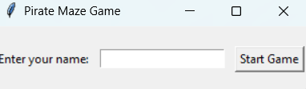
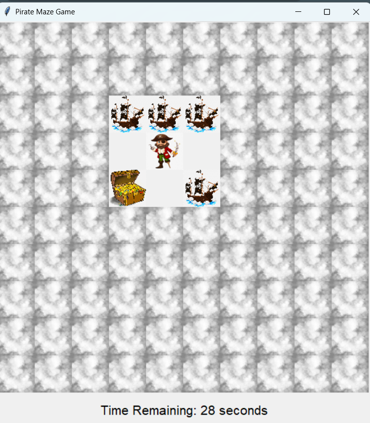
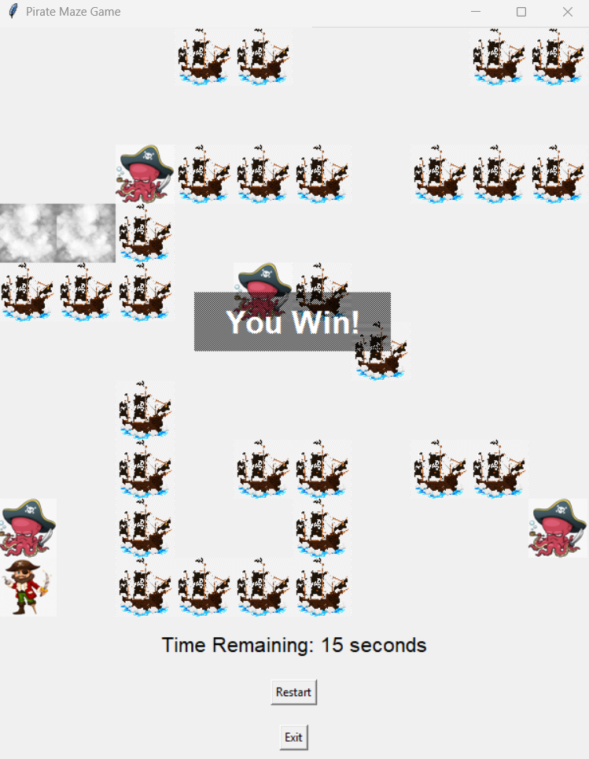
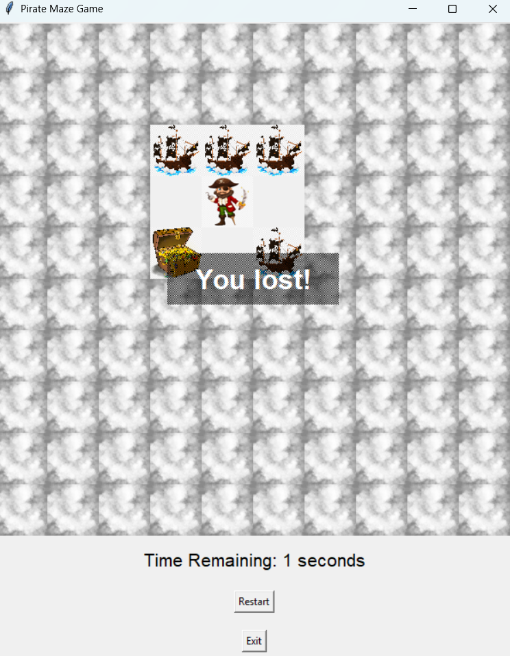

# 🏴‍☠️ Pirate Maze Game

A pirate-themed maze game built with **Python** and **Tkinter**, featuring:
- Enemies 🦈
- Hidden tiles with Fog  🌫️
- Random maze layouts
- Countdown timer ⏳
- Player progress saved to a `.json` file

---

## 🎮 How to Play

- Use the arrow keys (↑ ↓ ← →) to move the pirate
- Collect all the **treasure chests** before time runs out
- Avoid the **moving sharks** or get sent back to start!
- Fog lifts as you explore the maze
- Your result will be saved automatically with your name and time

---

## 🎨 Screenshots

### 🏴 Game Start

### 🌫️ How The Game Looks Like

### 🏆 Win Screen

### 💔 Lost Screen

